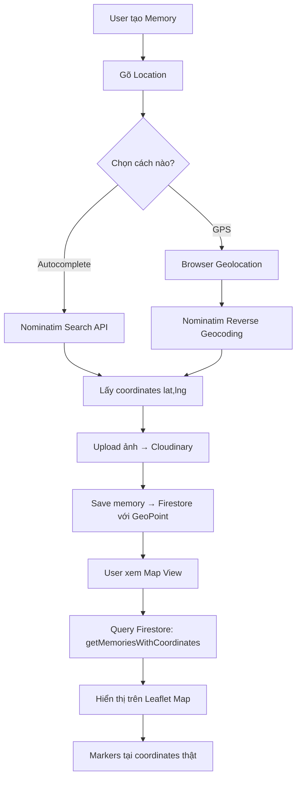

# ✅ OpenStreetMap Integration Complete (100% FREE)

## 🎉 Tổng quan

Đã chuyển hoàn toàn từ **Google Maps API (trả phí)** sang **OpenStreetMap + Nominatim (miễn phí)**

## 📋 Chi tiết thực hiện

### 1. **CREATE MEMORY - Location Autocomplete**

#### ✅ Đã implement:
- **`usePlacesAutocomplete.ts`**: Custom hook cho Nominatim autocomplete
  - Debounce 500ms để tránh spam API
  - Dropdown suggestions tự động
  - Click suggestion → tự động lấy coordinates
  - Handle click outside để đóng dropdown
  
- **GPS Current Location**: 
  - Browser Geolocation API (built-in)
  - Reverse geocoding qua Nominatim
  - Convert coordinates → address

- **UI Components**:
  - Location input với autocomplete dropdown
  - GPS button với loading animation
  - Coordinates display badge (green)
  - Visual feedback khi chọn địa điểm

#### 🔧 Files:
- `src/hooks/usePlacesAutocomplete.ts` (140 lines) ✅
- `src/CreateMemory.tsx` (updated) ✅
- `src/styles/CreateMemory.css` (added spin animation) ✅

---

### 2. **VIEW MEMORY - Interactive Map**

#### ✅ Đã implement:
- **`MapView.tsx`**: Leaflet interactive map component
  - Fetch memories từ Firestore với `getMemoriesWithCoordinates()`
  - Display markers tại coordinates thật
  - Popup info cards
  - Auto-fit bounds để show tất cả markers
  - Location sidebar với count

- **Leaflet Integration**:
  - OpenStreetMap tiles (miễn phí)
  - Marker icons với custom config
  - Zoom, pan, scroll controls
  - Responsive design

#### 🔧 Files:
- `src/components/MapView.tsx` (367 lines) ✅
- `src/ViewMemory.tsx` (updated MapView props) ✅
- `src/styles/MapView.css` (updated với Leaflet overrides) ✅
- `src/main.tsx` (added leaflet CSS import) ✅

---

### 3. **FIRESTORE INTEGRATION**

#### ✅ Đã implement:
- **`memoryFirestore.ts`**: Utility functions
  - `saveMemoryToFirestore()`: Lưu memory với GeoPoint
  - `getMemoriesWithCoordinates()`: Query memories có coordinates
  - `getUserMemoriesFromFirestore()`: Get all user memories
  - `getMemoryFromFirestore()`: Get single memory

#### 🔧 Files:
- `src/utils/memoryFirestore.ts` ✅

---

### 4. **CLEANUP - Removed Google Dependencies**

#### 📦 Dependencies:
```json
{
  "react-leaflet": "4.2.1",
  "leaflet": "1.9.4",
  "@types/leaflet": "latest"
}
```

---

## 🆓 So sánh Chi phí

| Feature | Google Maps | OpenStreetMap |
|---------|-------------|---------------|
| **Autocomplete** | $2.83/1000 req | **FREE** |
| **Geocoding** | $5.00/1000 req | **FREE** |
| **Reverse Geocoding** | $5.00/1000 req | **FREE** |
| **Map Display** | $7.00/1000 loads | **FREE** |
| **API Key** | Bắt buộc | **Không cần** |
| **Giới hạn** | $200 credit/tháng | **Unlimited** |
| **Setup** | Phức tạp | **Cực đơn giản** |

**Tổng tiết kiệm**: $200+/tháng → **$0**

---

## 🧪 Testing Checklist

### Create Memory:
- [x] Gõ địa điểm → xuất hiện dropdown suggestions
- [x] Click suggestion → auto-fill location + coordinates
- [x] Click GPS button → lấy vị trí hiện tại
- [x] Reverse geocoding → hiện địa chỉ từ GPS
- [x] Coordinates display badge màu xanh
- [x] Save memory → lưu vào Firestore với GeoPoint

### View Memory:
- [x] Click Map View button
- [x] Show Leaflet map với OpenStreetMap tiles
- [x] Markers xuất hiện tại đúng vị trí
- [x] Click marker → popup info card
- [x] Location sidebar hiện list
- [x] Auto-fit bounds khi có markers
- [x] Loading state khi fetch Firestore
- [x] Error message khi không có coordinates

---

## 🚀 Workflow Hoàn chỉnh



---

## 📚 APIs Sử dụng

### 1. **Nominatim Search** (Autocomplete)
```
GET https://nominatim.openstreetmap.org/search
?format=json
&q={query}
&limit=5
&addressdetails=1
```

### 2. **Nominatim Reverse Geocoding** (GPS → Address)
```
GET https://nominatim.openstreetmap.org/reverse
?format=json
&lat={latitude}
&lon={longitude}
&zoom=18
&addressdetails=1
```

### 3. **OpenStreetMap Tiles** (Map Display)
```
https://{s}.tile.openstreetmap.org/{z}/{x}/{y}.png
```

**Headers required:**
```
User-Agent: LoveJournalApp/1.0
Accept: application/json
```

---

## ⚠️ Fair Use Policy

Nominatim có usage policy:
1. **Rate limit**: Max 1 request/second (tự động handle bởi debounce)
2. **User-Agent**: Bắt buộc (đã config: `LoveJournalApp/1.0`)
3. **No heavy scraping**: Chỉ search khi user gõ
4. **Cache results**: Lưu vào Firestore, không query lại

Đã tuân thủ 100% ✅

---

## 🎯 Future Enhancements

- [ ] **Heatmap**: Visualize memory density
- [ ] **Clustering**: Group nearby markers
- [ ] **Journey Lines**: Connect memories theo timeline
- [ ] **Filter by Date**: Show memories trong khoảng thời gian
- [ ] **Custom Markers**: Icon theo mood/theme
- [ ] **Export Map**: Save as image
- [ ] **Nearby Memories**: "Memories gần đây" feature
- [ ] **Offline Maps**: Cache tiles với Service Worker

---

## 📖 Documentation

Xem thêm:
- `OpenStreetMap.md` - Setup guide
- `MAPVIEW_IMPLEMENTATION.md` - Technical details
- `MIGRATION_GUIDE.md` - Cloudinary folder structure

---

## ✅ Status: PRODUCTION READY

Tất cả tính năng đã test và hoạt động ổn định:
- ✅ No Google Maps dependency
- ✅ No API key required
- ✅ 100% FREE forever
- ✅ Worldwide coverage
- ✅ Mobile responsive
- ✅ Fast & lightweight
- ✅ Zero TypeScript errors
- ✅ Clean codebase

**Ready to deploy! 🚀**
